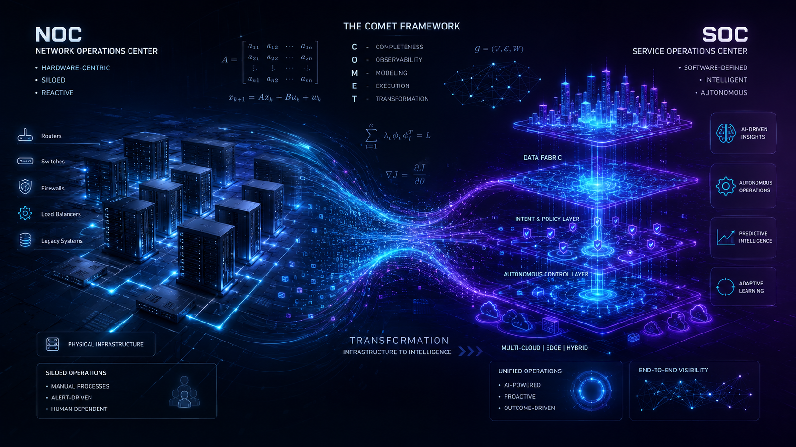

# Co-evolutionary Operations Maturity and Epistemic Transformation (COMET): A Unified Theory of NOC-to-SOC Migration

**Authors**

AlHussein A. AlSahati¹ and Houda Chihi², 
¹ *Military Academy for Security and Strategic Sciences, Benghazi, Libya*

² *Higher School of Communication of Tunis (Sup'Com), University of Carthage, Ariana, Tunisia*

Contact: hussein.alagore@gmail.com, houda.chihi@supcom.tn

## Abstract

The migration from Network Operations Centers (NOCs) to Service Operations Centers (SOCs) constitutes one of the most consequential structural transformations in the global telecommunications industry. Despite the proliferation of industry frameworks like the TM Forum's Autonomous Operations Maturity Model (AOMM), theoretical explanations remain fragmented. In this paper, we propose the **Co-evolutionary Operations Maturity and Epistemic Transformation (COMET)** theory, a unified framework that synthesizes prior perspectives through formal mathematical modeling.

COMET is grounded in Dynamic Capabilities Theory, Socio-Technical Systems Theory, and Boundary Object Theory, organized around seven interconnected dimensions: Technological Maturity, Epistemic Infrastructure, Data Fabric Maturity, Cultural Readiness, Organizational Morphology, Contextual Maturity, and Value Governance. This repository hosts the Python-based numerical simulations designed to empirically validate COMET's 10 formal mathematical models, including Expected Demand Not Served (EDNS), Data Fabric-MTTR exponential decay, and Markov transition models for maturity progression.

## Document Statistics

| Metric | Value |
| --- | --- |
| Manuscript Pages | ~25 |
| Mathematical Models | 10 |
| Testable Hypotheses | 8 |
| Simulation Scenarios | 4 |
| References | 35+ |

## Repository Contents

| Directory / File | Description |
| --- | --- |
| `models/edns.py` | Numerical integration algorithm for calculating the capacity-demand gap (EDNS). |
| `models/mttr_decay.py` | Exponential decay simulation mapping Data Fabric Investment (DFI) to MTTR reduction. |
| `models/markov_transition.py` | Multinomial Logit Markov chain simulating non-linear AOMM maturity transitions. |
| `models/cost_benefit.py` | Net present value (NPV) trajectory of closed-loop automation investment over time. |
| `simulation/` | Scenario runners simulating 36-month transformation trajectories for different operator archetypes. |
| `docs/figures/` | High-resolution plots generated by the simulation models (ready for JTIT submission). |
| `manuscript/` | Complete LaTeX source code for the academic manuscript. |

<div align="center">
  
</div>

## Key Features

* **Mathematical Formalization:** Translates qualitative maturity frameworks (AOMM, VOF) into 10 rigorously defined mathematical models.
* **EDNS Quantification:** Direct calculation of Expected Demand Not Served as a proxy for revenue-at-risk during network degradation events.
* **Non-Linear Trajectory Modeling:** Utilizes Markov chains to accurately simulate organizational stagnation, regression, and equilibrium states, moving beyond linear phase models.
* **Maturity Coherence Index (MCI):** A novel metric proving that balanced cross-dimensional development predicts transformation success more accurately than raw technological maturity.

## Simulation Parameters

| Parameter | Value | Config Variable | Description |
| --- | --- | --- | --- |
| Simulation Horizon ($T$) | 36 Months | `t_max_months` | Standard migration window. |
| MTTR Decay Rate ($\lambda$) | 0.8 | `decay_lambda` | Marginal effectiveness of DFI. |
| Baseline MTTR ($MTTR_0$) | 240 minutes | `mttr_baseline` | Initial mean time to repair. |
| Coherence Dimensions ($K$) | 7 | `k_dimensions` | The 7 COMET dimensions. |
| AOMM Levels | 0 to 5 | `aomm_levels` | Operational autonomy levels. |

## Key Findings (Numerical Simulation)

| Evaluated Construct | Method | Key Finding |
| --- | --- | --- |
| **MTTR Reduction** | Exponential Decay Model | Foundational data unification ($DFI=1$ to $2$) yields drastic MTTR drops; subsequent investments show diminishing returns. |
| **Transformation Trajectory** | Markov Transition Matrix | High Cultural Readiness Composite (CRC) prevents maturity backsliding (regression) during the 36-month horizon. |
| **Investment Prioritization** | Cost-Benefit NPV Model | Service Graph Maturity Index (SGMI) must precede large-scale AI deployment to achieve positive NPV. |

## Academic Limitations & Scope

This repository focuses strictly on the numerical simulation and mathematical validation of the COMET theoretical framework.

* **Simulated Telemetry:** The inputs for EDNS and Markov transitions rely on Monte Carlo generated datasets simulating operator states. Real-world operator data is required for the precise empirical estimation of the regression coefficients in Model 7.
* **Not a Production Engine:** The code provided is structured for academic reproducibility, peer review, and mathematical plotting using `SciPy`/`NumPy`. It is not a deployment-ready closed-loop automation engine for live OSS/BSS environments.

## Installation & Quick Start

1. **Clone the repository:**

```bash
git clone https://github.com/Chihi-Sahati/NOC-to-SOC-COMET-Models.git
cd NOC-to-SOC-COMET-Models
```

2. **Set up the environment:**

```bash
python -m venv venv
source venv/bin/activate  # On Windows: .\venv\Scripts\activate
pip install -r requirements.txt
```

3. **Run the Simulations & Generate Plots:**

```bash
# Generate the MTTR Decay plot
python models/mttr_decay.py

# Generate the Markov Transition MCI Evolution plot
python models/markov_transition.py

# Generate the EDNS Integral plot
python models/edns.py
```

*Generated plots will be saved to the `docs/figures/` directory.*

## Mathematical Formulation

The COMET framework introduces formal models for constructs previously treated only qualitatively.

**Model 8: Data Fabric Investment–MTTR Relationship**

The relationship between Data Fabric Investment ($DFI$) and Mean Time to Repair ($MTTR$) is modeled as an exponential decay function:
$$ MTTR(DFI) = MTTR_0 \cdot \exp(-\lambda \cdot DFI) $$

**Model 1: Expected Demand Not Served (EDNS)**

Quantifies the cumulative gap between expected demand ($D_{exp}$) and served capacity ($S_{cap}$):
$$ EDNS(T) = \int_{0}^{T} \max(D_{exp}(t) - S_{cap}(t), 0) dt $$

**Model 10: Markov Transition Model for Maturity Progression**

The transition of an operator’s maturity state across AOMM levels (0-5):
$$ P(L_{k, t+1} = j \mid L_{k, t} = i, X) = \frac{\exp(X \beta_{ij})}{\sum_{l=0}^{5} \exp(X \beta_{il})} $$

*(Please refer to the full manuscript in the `manuscript/` directory for the complete derivations of all 10 equations, including SGMI, MCI, and CRC).*

## Citation

If you find this theoretical framework and its numerical models useful in your research, please cite our paper:

```bibtex
@article{alsahati2026comet,
  title={Beyond the Operations Center: A Unified Co-evolutionary Theory of NOC-to-SOC Migration in the Telecommunications Sector},
  author={Al-Sahati, AlHussein A. and Chihi, Houda},
  journal={Journal of Telecommunications and Information Technology (JTIT)},
  year={2026},
  note={Submitted}
}
```

## License

This project is licensed under the MIT License - see the `LICENSE` file for details.

<br/>
<div align="center">
  <b>Built at InnovCOM Lab of SupCOM Tunisia</b>
</div>
